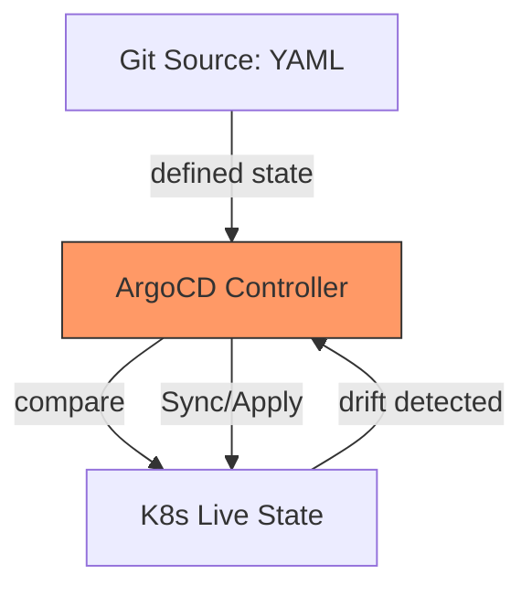

# SC-01: ArgoCD Sync Logic (The Reconciliation Loop)

> **"Jangan dorong perubahan ke server; biarkan server menarik kebenaran dari Git."**

## 🔗 1. Source Link
- [ArgoCD Architecture (Official)](https://argo-cd.readthedocs.io/en/stable/understand_concepts/)

## 📖 2. Penjelasan (The What & The Why)
**ArgoCD** adalah pengontrol GitOps *pull-based* untuk Kubernetes. Alih-alih CI/CD tradisional yang melakukan "push" ke klaster, ArgoCD berjalan di dalam klaster dan secara aktif memantau repositori Git. Ia bertugas mendeteksi perbedaan (*drift*) antara kode di Git dan kondisi nyata di klaster, lalu memperbaikinya secara otomatis.

## 🏗️ 3. Architecture Concept: The Mirror Effect
Bayangkan sebuah **Cermin Pintar**. Anda (Developer) mengubah penampilan Anda di depan cermin (Git). Cermin tersebut mendeteksi bahwa bayangan Anda tidak cocok dengan diri Anda yang asli di dunia nyata (Klaster). Secara ajaib, cermin tersebut "mengubah" diri Anda di dunia nyata agar persis seperti bayangan yang ada di cermin tersebut.

## 📊 4. Visual Graph (Mermaid)
Loop Rekonsiliasi ArgoCD:



## 🛠️ 5. Under-the-hood Mechanics
ArgoCD memiliki komponen bernama **Application Controller**. Ia secara berkala (default tiap 3 menit) melakukan `git fetch` untuk mendapatkan hash commit terbaru. Ia kemudian mengurai manifest YAML/Helm/Kustomize dan membandingkan metadata-nya dengan API Kubernetes. Jika ada perbedaan, ia akan menjalankan `kubectl apply` secara terprogram.

## 🧪 6. Practical CLI Lab
Melihat status sinkronisasi via ArgoCD CLI:

```bash
# Melihat daftar aplikasi yang dikelola
argocd app list

# Melakukan sinkronisasi manual jika drift terdeteksi
argocd app sync <app-name>

# Melihat perbedaan (diff) antara Git dan Klaster
argocd app diff <app-name>
```

## 🤝 7. Team Impact (Social Governance)
ArgoCD menghilangkan ketergantungan pada **Kubeconfig** di workstation lokal. Pengembang tidak perlu memiliki akses `write` ke klaster; mereka cukup memiliki akses `write` ke repositori Git. Ini meningkatkan keamanan secara drastis (Principle of Least Privilege).

## 🚑 8. The Rescue (Undo Tactics): Self-Healing
Jika seseorang secara tidak sengaja menghapus *Deployment* di klaster secara manual via terminal:
1. ArgoCD akan mendeteksi bahwa *resource* tersebut hilang (Missing).
2. Karena fitur **Self-Healing** aktif, ArgoCD akan segera membuat ulang *deployment* tersebut berdasarkan data yang ada di Git.
*Kebenaran mutlak ada di Git, bukan di perintah manual terminal.*
