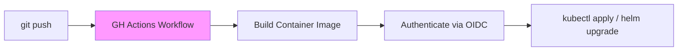

# SC-02: GitHub Actions Deploy (Push-Based GitOps)

> **"Otomasi tanpa batas antara kode aplikasi dan infrastruktur produksi."**

## 🔗 1. Source Link
- [GitHub Actions for Kubernetes (GitHub Docs)](https://docs.github.com/en/actions/deployment/deploying-to-kubernetes)

## 📖 2. Penjelasan (The What & The Why)
Meskipun *pull-based* (seperti ArgoCD) adalah standar emas GitOps, banyak tim memulai dengan **Push-Based GitOps** menggunakan **GitHub Actions**. Di sini, alur kerja (workflow) dipicu oleh `push` ke cabang tertentu, yang kemudian menjalankan perintah deployment ke server atau klaster target. Ini adalah jembatan tercepat dari CI ke CD.

## 🏗️ 3. Architecture Concept: The Automated Courier
Bayangkan sebuah **Kurir Otomatis**. Segera setelah Anda menyelesaikan sebuah paket (Commit), kurir tersebut (GitHub Actions) langsung mengambil paket itu, membawanya ke gudang pusat (Production), dan memastikan paket tersebut diletakkan di rak yang benar.

## 📊 4. Visual Graph (Mermaid)
Pipeline Deployment Push-Based:



## 🛠️ 5. Under-the-hood Mechanics
GitHub Actions berinteraksi dengan infrastruktur melalui **Secrets** atau **OIDC (OpenID Connect)**. OIDC lebih disukai pengembang Senior karena tidak memerlukan penyimpanan token permanen di GitHub; sebaliknya, GitHub bertukar token jangka pendek dengan Cloud Provider (seperti AWS/Azure/GCP) untuk melakukan deployment secara aman.

## 🧪 6. Practical CLI Lab
Contoh snippet deployment sederhana di YAML:

```yaml
- name: Deploy to Kubernetes
  run: |
    kubectl set image deployment/myapp myapp=${{ steps.build-image.outputs.image }}
    kubectl rollout status deployment/myapp
```

## 🤝 7. Team Impact (Social Governance)
Push-based GitOps memusatkan **Visibilitas**. Seluruh tim bisa melihat status deployment langsung di tab "Actions" atau di halaman Pull Request. Komunikasi menjadi lebih lancar karena status "Berhasil" atau "Gagal" terdokumentasi secara otomatis di tempat kode berada.

## 🚑 8. The Rescue (Undo Tactics): Manual Trigger Rollback
Jika deployment otomatis gagal di tengah jalan:
1. Gunakan fitur **Re-run failed jobs** di GitHub Actions.
2. Atau, jalankan workflow rollback kustom yang melakukan `git revert` pada manifest infrastruktur untuk mengembalikan versi image ke tag sebelumnya yang stabil.
