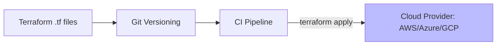

# CH-01: Terraform State in Git (IaC Versioning)

> **"Infrastruktur modern bukan lagi tentang kabel dan server fisik, melainkan tentang baris kode yang imutabel."**

## 🔗 1. Source Link
- [Terraform State (Official)](https://www.terraform.io/docs/language/state/index.html)

## 📖 2. Penjelasan (The What & The Why)
**Infrastructure as Code (IaC)** memungkinkan kita mendefinisikan infrastruktur (Virtual Machines, Jaringan, Database) menggunakan file teks. Menaruh file IaC (seperti Terraform `.tf`) ke dalam Git memungkinkan tim untuk memiliki riwayat perubahan infrastruktur yang sama persatunya dengan riwayat kode aplikasi. Ini menjamin **Reproducibility**—kemampuan untuk membangun kembali seluruh lingkungan dari nol hanya dengan menjalankan kode di Git.

## 🏗️ 3. Architecture Concept: The Blueprint for Reality
Bayangkan sebuah **Cetak Biru (Blueprint)** gedung. Dulu, jika ingin menambah lantai, orang langsung membangunnya. Sekarang, kita harus mengubah cetak biru di meja gambar (Git) terlebih dahulu. Setelah disetujui, robot konstruksi (Terraform) akan datang dan menyesuaikan gedung asli agar persis seperti cetak biru terbaru.

## 📊 4. Visual Graph (Mermaid)
Manajemen Versi Infrastruktur:



## 🛠️ 5. Under-the-hood Mechanics
Tantangan terbesar IaC di Git adalah **State Management**. IaC butuh file state untuk tahu apa yang sudah dibuat. File state ini **Dilarang Keras** disimpan langsung di Git jika berisi data sensitif. Praktik terbaik adalah menyimpan kode `.tf` di Git, tetapi file `terraform.tfstate` di-remote ke backend yang aman (sepert S3 dengan enkripsi).

## 🧪 6. Practical CLI Lab
Versioning perubahan infrastruktur:

```bash
# Menambahkan definisi server baru
cat <<EOF > main.tf
resource "aws_instance" "web" {
  ami           = "ami-0c55b159cbfafe1f0"
  instance_type = "t2.micro"
}
EOF

# Mencatat perubahan ke sejarah Git
git add main.tf
git commit -m "infra: provision new t2.micro web server in aws"
```

## 🤝 7. Team Impact (Social Governance)
IaC di Git memberlakukan **Peer Review for Infrastructure**. Sebelum server baru dibuat, senior engineer harus memberikan `Approve` pada PR tersebut. Ini mencegah kesalahan konfigurasi (seperti membuka port database ke publik) yang bisa berakibat fatal bagi keamanan perusahaan.

## 🚑 8. The Rescue (Undo Tactics): Destroy and Rebuild
Jika konfigurasi infrastruktur di cabang utama rusak:
1. Revert commit terakhir di Git.
2. Jalankan kembali pipeline CI.
3. Terraform akan mendeteksi perbedaan dan menghapus/mengubah resource yang salah untuk kembali ke kondisi stabil.
