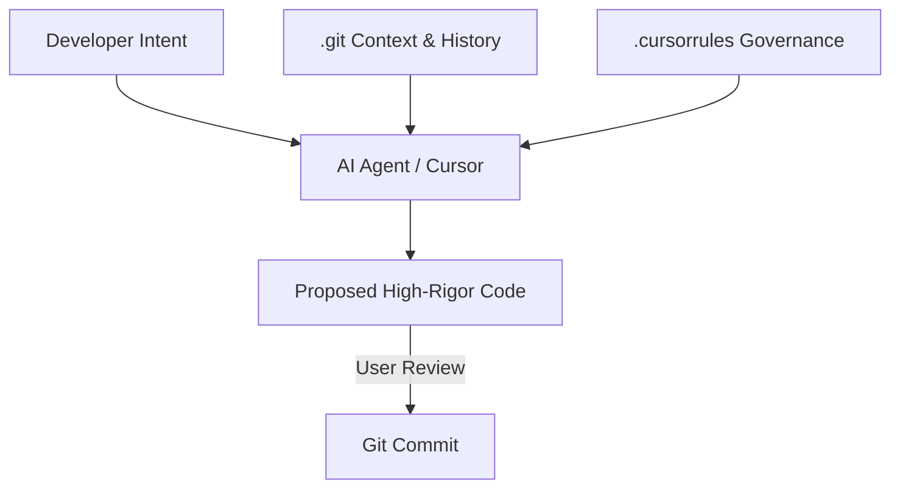

# CH-01: Cursor Agentic Architecture (AI-Assisted workflows)

> **"AI bukan pengganti pengembang; ia adalah akselerator konteks di dalam lorong waktu Git."**

## 🔗 1. Source Link
- [AI-Assisted Development Best Practices](https://www.cursor.com/)

## 📖 2. Penjelasan (The What & The Why)
Dalam era **Agentic Coding**, AI (seperti Cursor) menggunakan seluruh riwayat dan struktur repositori Git sebagai konteks untuk memberikan saran kode yang sangat akurat. Dengan memahami DAG, pesan commit, dan aturan tata kelola di `.cursorrules`, AI dapat bertindak sebagai mitra cerdas yang memahami *alasan* di balik sebuah keputusan arsitektural—bukan sekadar pelengkap kata otomatis.

## 🏗️ 3. Architecture Concept: The Co-Pilot with a Map
Bayangkan Anda sedang terbang di malam hari (mengerjakan codebase besar yang asing). AI adalah **Co-Pilot** yang memiliki **Peta Digital** (Git Context). Ia tidak hanya membantu Anda memegang kemudi (menulis fungsi), tapi juga memperingatkan Anda tentang rintangan di depan berdasarkan data penerbangan sebelumnya (Sejarah Commit).

## 📊 4. Visual Graph (Mermaid)
Sinergi Manusia-AI-Git:



## 🛠️ 5. Under-the-hood Mechanics: Context Slicing
AI Agent bekerja dengan melakukan **Context Slicing**. Ia tidak membaca seluruh repositori sekaligus (yang akan memakan banyak token), melainkan memilih "irisan" file yang relevan berdasarkan posisi kursor dan referensi di dalam file tersebut. Aturan di `.cursorrules` memberikan instruksi tambahan kepada AI untuk selalu mematuhi standar **GMGS** dalam setiap output yang dihasilkan.

## 🧪 6. Practical CLI Lab
Berinteraksi dengan AI menggunakan konteks Git:

```markdown
# Contoh Prompt Agentic:
"Berdasarkan standar GMGS di RAK-01, buatkan draft Chapter untuk RAK-09 
yang mencakup visualisasi Mermaid tentang keamanan Git."
```

## 🤝 7. Team Impact (Social Governance)
AI-Assisted workflows meningkatkan **Engineering Velocity** secara masif. Tugas-tugas berulang (boilerplate, dokumentasi struktur) bisa didelegasikan ke AI, sehingga pengembang manusia bisa lebih fokus pada desain tingkat tinggi dan integritas logika bisnis.

## 🚑 8. The Rescue (Undo Tactics): AI Revert
Jika saran AI ternyata menyesatkan atau merusak struktur:
1. Gunakan fitur **Undo** pada IDE AI.
2. Jika sudah terlanjur di-commit:
```bash
# Kembalikan ke titik sebelum AI 'mengacau'
git reset --hard HEAD~1
```
*Selalu tinjau (review) setiap baris kode yang dihasilkan AI sebelum melakukan commit.*
