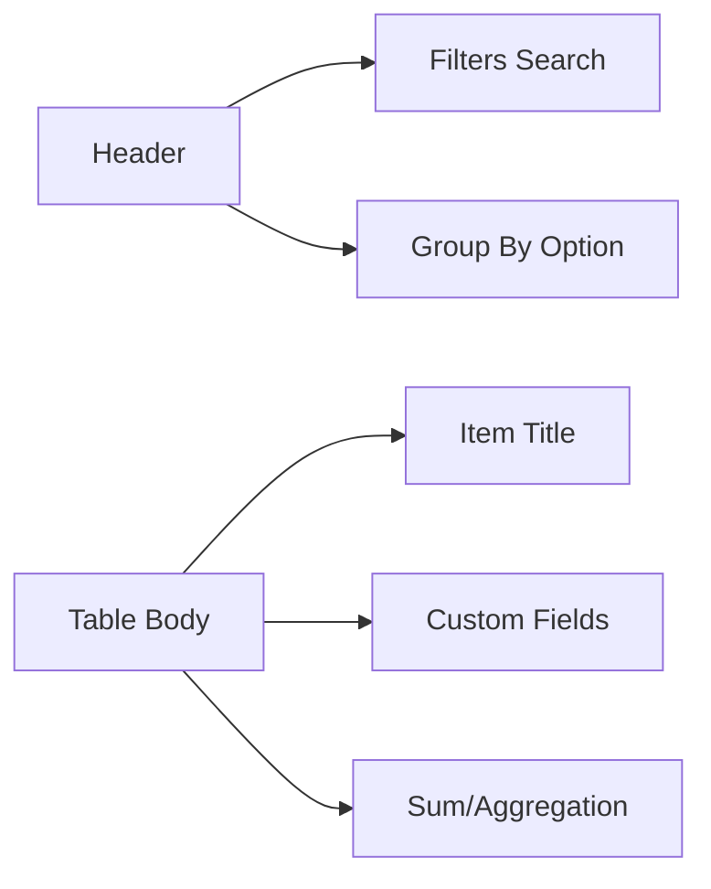

# 📊 CH-01: The Table View (Analytics & Bulk Editing)

> **"Tabel adalah spreadsheet yang terhubung langsung ke sumber kebenaran (Source of Truth)."**

## 🔗 1. Source Link
- [GitHub: Managing your views](https://docs.github.com/en/issues/planning-and-tracking-with-projects/customizing-your-views/managing-your-views)
- [GitHub: Filtering and sorting project items](https://docs.github.com/en/issues/planning-and-tracking-with-projects/customizing-your-views/filtering-and-sorting-project-items)

## 📖 2. Penjelasan (The What & The Why)
**Table View** adalah tampilan utama untuk mengelola data proyek dalam jumlah besar secara efisien. Berbeda dengan Board yang berfokus pada alur (*flow*), Table berfokus pada **Presisi**.
- **Bulk Editing**: Mengubah status atau prioritas banyak item sekaligus.
- **Aggregation**: Melihat total estimasi atau poin per kategori.
- **Precision Filtering**: Melakukan query kompleks untuk menemukan item spesifik.

## 🏗️ 3. Architecture Concept: The Data Spreadsheet
Bayangkan sebuah **Ruang Kontrol**.
- Jika Board adalah "CCTV" yang memantau pergerakan, maka Table adalah **Dasbor Analitik** yang menunjukkan angka-angka di balik layar. 
- Senior Engineer menggunakan Table untuk melakukan **Audit Backlog**—memastikan tidak ada tugas yang tidak memiliki label atau *assignee*.

## 📊 4. Visual Layout (Table Components)


## 🧪 5. CLI Labs (Filtering with gh)
Gunakan GitHub CLI untuk melihat data dalam format tabel via terminal.
```bash
# List items in table-like format
gh project item-list [PROJECT_NUMBER] --owner [OWNER] --format json | jq '.[] | {title, status}'
```

## 🛠️ 6. Under-the-hood Mechanics
Table View secara internal menyimpan konfigurasi filter, pengurutan (*sorting*), dan pengelompokan (*grouping*) di dalam layer UI. Saat Anda memfilter data, GitHub melakukan query ke database Projects v2 untuk hanya menampilkan objek yang relevan tanpa me-refresh seluruh halaman.

## 🤝 7. Team Impact
Memudahkan Manajer Proyek dan Tech Lead dalam melakukan **Grooming Backlog**. Kecepatan dalam mengedit puluhan item sekaligus menghemat waktu rapat koordinasi mingguan secara drastis.

## 🚑 8. Senior Tip: View Saving
Jangan biarkan satu Table View dipenuhi oleh ratusan filter. **Buatlah View baru** yang sudah ter-filter untuk kebutuhan spesifik (Contoh: View "P1 Bugs", View "Sprint Backlog") dan simpan dengan nama yang jelas agar rekan tim bisa menemukannya dengan satu klik.
