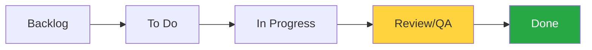

# 📋 CH-02: The Board View (Flow & Kanban)

> **"Pindah kartu bukan sekadar administratif, itu adalah bukti progres nyata."**

## 🔗 1. Source Link
- [GitHub: Getting started with your board](https://docs.github.com/en/issues/planning-and-tracking-with-projects/learning-about-projects/getting-started-with-projects#getting-started-with-your-board)
- [Kanban vs Scrum on GitHub Projects](https://github.com/features/issues)

## 📖 2. Penjelasan (The What & The Why)
**Board View** adalah representasi visual dari aliran kerja (*Workflow*). Kartu-kartu diletakkan dalam kolom-kolom yang biasanya mewakili status (To Do, In Progress, Review, Done). Fokus utamanya adalah **Aliran** dan **Limitasi**.
- **Visual Flow**: Menunjukkan tumpukan pekerjaan di setiap tahap.
- **Drag-and-Drop**: Kemudahan dalam mengubah status tugas secara intuitif.
- **WIP Limits**: (Work In Progress) Strategi untuk membatasi jumlah kartu di kolom tertentu agar tim fokus menyelesaikan satu hal.

## 🏗️ 3. Architecture Concept: The Assembly Line
Bayangkan sebuah **Lini Produksi Mobil**.
- Setiap kolom adalah stasiun perakitan. 
- Jika satu kolom (misal "Review") macet karena terlalu banyak kartu, seluruh lini produksi akan berhenti. 
- Senior Engineer memantau Board untuk memastikan tidak terjadi penumpukan (*bottleneck*) dan tim tetap bergerak ke arah penyelesaian.

## 📊 4. Visual Workflow (The Kanban Pull)


## 🧪 5. CLI Labs (Updating Item Status)
Gunakan GitHub CLI untuk memindahkan item antar kolom board.
```bash
# Update item project ke status tertentu (Field ID Status)
gh project item-edit [PROJECT_NUMBER] --id [ITEM_ID] --field-id [FIELD_ID] --project-id [PROJECT_ID] --single-select-option-id [OPTION_ID]
```

## 🛠️ 6. Under-the-hood Mechanics
Board View menggunakan mekanisme **Single-Select Fields** sebagai dasar kolom. Setiap kali Anda menarik kartu antar kolom, GitHub memicu pembaruan metadata pada field status di database Projects v2, yang kemudian dapat memicu **Project Workflows** (otomasi) ke repository terkait.

## 🤝 7. Team Impact
Menciptakan **Visual Transparency**. Seluruh tim bisa melihat kesibukan masing-masing personil secara real-time tanpa harus bertanya. Ini mengurangi frekuensi pertemuan sinkronisasi (Daily Sync) secara signifikan.

## 🚑 8. Senior Tip: Grouping by Assignee
Gunakan fitur **"Group by Assignee"** di atas Board View. Ini sangat efektif selama rapat stand-up harian untuk melihat beban kerja setiap anggota tim secara individu dan mendiskusikan hambatan yang mereka hadapi.
