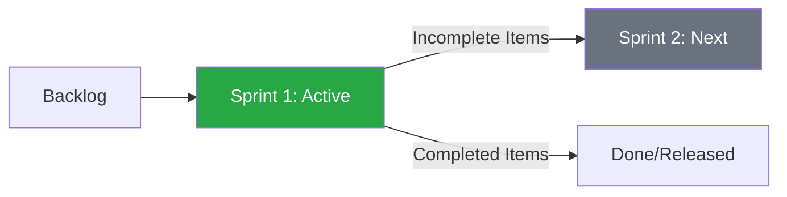

# ⏩ CH-01: Iteration Management (Sprints)

> **"Sprint bukan lari cepat, tapi detak jantung proyek yang stabil."**

## 🔗 1. Source Link
- [GitHub: About iteration fields](https://docs.github.com/en/issues/planning-and-tracking-with-projects/understanding-fields/about-iteration-fields)
- [GitHub: Managing iterations in your project](https://docs.github.com/en/issues/planning-and-tracking-with-projects/understanding-fields/managing-iterations-in-your-project)

## 📖 2. Penjelasan (The What & The Why)
**Iteration Field** adalah fitur khusus di GitHub Projects v2 yang dirancang untuk mengelola siklus waktu berulang (seperti Sprint 1, Sprint 2). Berbeda dengan *Date Field* biasa, Iteration memiliki durasi tetap dan logika "Current" (Saat ini) serta "Next" (Berikutnya) yang otomatis.
- **Sprint Scoping**: Mengelompokkan pekerjaan yang harus selesai dalam kurun waktu tertentu (misal: 2 minggu).
- **Time Boxing**: Memastikan tim fokus pada target jangka pendek.
- **Automatic Rollover**: Kemudahan dalam memindahkan tugas yang belum selesai ke iterasi berikutnya.

## 🏗️ 3. Architecture Concept: The Time Containers
Bayangkan sebuah **Kereta Api**.
- Setiap gerbong adalah satu **Iterasi** (Sprint). 
- Anda hanya bisa memasukkan sejumlah barang (Tugas) yang sesuai dengan kapasitas gerbong tersebut. 
- Gerbong akan berangkat sesuai jadwal (Start/End Date). 
- Senior Engineer memastikan "Gerbong" tidak kelebihan muatan dan jalur keretanya teratur.

## 📊 4. Visual Workflow (Sprint Transition)


## 🧪 5. CLI Labs (Iteration Filtering)
Gunakan GitHub CLI untuk memfilter tugas berdasarkan iterasi saat ini.
```bash
# List items in the current iteration
gh project item-list [PROJECT_NUMBER] --owner [OWNER] --filter "iteration:current"
```

## 🛠️ 6. Under-the-hood Mechanics
Secara internal, GitHub Projects mengelola objek Iterasi dengan atribut `startDate` dan `duration`. Sistem secara otomatis menghitung iterasi mana yang berstatus "Current" berdasarkan tanggal hari ini. Hal ini memungkinkan filter dinamis pada tampilan Board atau Roadmap tanpa perlu mengubah konfigurasi secara manual setiap minggu.

## 🤝 7. Team Impact
Menciptakan **Focus & Rhythm**. Tim tahu persis apa yang menjadi prioritas dalam 1-2 minggu ke depan. Hal ini mengurangi gangguan dari ide-ide baru yang belum masuk ke dalam perencanaan Iterasi saat ini.

## 🚑 8. Senior Tip: Iteration Automation
Gunakan fitur **"Auto-add to Iteration"** melalui GitHub Actions atau Project Workflows. Anda bisa mengatur agar setiap Issue yang diberi label `sprint-ready` otomatis masuk ke "Current Iteration". Ini menghilangkan kebutuhan manual untuk menarik kartu ke dalam gerbong setiap Senin pagi.
