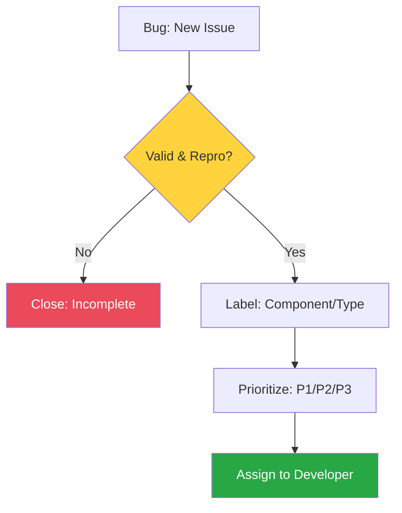

# 🛡️ CH-01: Triage System (Bug Validation)

> **"Proses triage adalah gerbang pertama dalam menjaga kualitas software."**

## 🔗 1. Source Link
- [GitHub: Understanding the Triage role](https://docs.github.com/en/organizations/managing-access-to-your-organizations-repositories/repository-roles-for-an-organization#triage-role-for-an-organization)
- [How to Triage Issues on GitHub](https://opensource.guide/how-to-contribute/#how-to-submit-a-contribution)

## 📖 2. Penjelasan (The What & The Why)
**Triase (Triage)** adalah proses peninjauan, pemilahan, dan pemrioritasan issue atau bug yang masuk ke dalam repository. Tujuan utamanya adalah memastikan setiap laporan bug memiliki data yang cukup (reproducible) dan menentukan apakah laporan tersebut valid atau tidak.
- **Filtering**: Membuang laporan duplikat atau yang tidak jelas.
- **Labeling**: Memberikan identitas awal (Type, Component, Severity).
- **Prioritizing**: Menentukan apakah bug ini harus diperbaiki SEKARANG (P1) atau bisa nanti (P3).

## 🏗️ 3. Architecture Concept: The Emergency Room
Bayangkan sebuah **IGD Rumah Sakit**.
- Tidak semua pasien yang datang langsung dioperasi. 
- Petugas Triase memeriksa tingkat keparahan (Luka gores vs Serangan Jantung). 
- Di GitHub, Senior Engineer bertindak sebagai dokter triase yang menentukan urutan "operasi" kode agar sumber daya tim fokus pada masalah yang paling kritis bagi bisnis.

## 📊 4. Triage Workflow (Visual Flow)


## 🧪 5. CLI Labs (Bulk Labeling)
Gunakan GitHub CLI untuk melakukan triase massal terhadap issue yang masuk.
```bash
# Memberikan label bug dan P1 ke semua issue baru
gh issue list --state open --label "new" --json number -q '.[].number' | xargs -I % gh issue edit % --add-label "bug,P1" --remove-label "new"
```

## 🛠️ 6. Under-the-hood Mechanics
Secara internal, meta-data label dan milestone dari GitHub Issues disinkronkan langsung ke Projects v2. Saat label berubah melalui CLI atau Web UI, Project Board akan secara otomatis mencerminkan perubahan tersebut melalui aturan **Automation Workflows**.

## 🤝 7. Team Impact
Menciptakan **Quality Gate**. Tim developer tidak akan terganggu oleh laporan bug yang "sampah" (tidak bisa direproduksi). Mereka hanya akan mengerjakan bug yang sudah divalidasi dan diprioritaskan oleh sistem triase.

## 🚑 8. Senior Tip: Triage Templates
Gunakan fitur **Issue Templates** (YAML) untuk memaksa pengguna mendaftarkan bug dengan data minimal: Versi OS, Langkah Reproduksi, dan Hasil yang Diharapkan. Triage akan menjadi 10x lebih cepat jika input datanya sudah terstruktur sejak awal.
